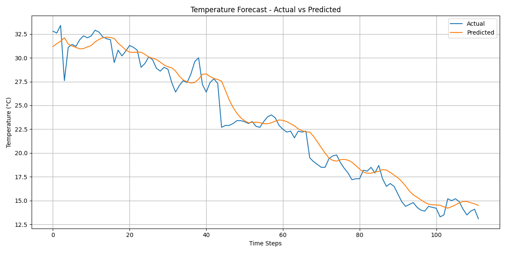

# 🌦️ Weather Forecasting Using Machine Learning

Welcome to the **Weather Forecasting** project! This project focuses on building a machine learning pipeline that forecasts temperature trends based on historical weather data. It uses deep learning (LSTM), a preprocessing pipeline, and an interactive Streamlit dashboard to visualize future temperature predictions.


---


## 📌 What Are We Trying to Do?

In this project, we are:


1. **Predicting future weather conditions** – primarily temperature – using machine learning.

2. **Cleaning and preparing weather data** to remove outliers and ensure accurate model input.

3. **Training an LSTM model** on historical temperature data to forecast future values.

4. **Visualizing predictions** using plots and a live **Streamlit dashboard**.

5. **Saving important artifacts** like the scaler and model for future use.

6. **Laying the groundwork for automation** of data updates and potential deployment to dashboards like Supaboard.


This system is designed to help users—such as farmers, event organizers, and logistics professionals—make informed decisions based on upcoming weather trends.


---


## 📁 Project Structure

```

SHUBHAM-MALVIYA2/

│

├── Weather forecasting.ipynb             # Jupyter notebook for EDA, LSTM training & evaluation

├── Weather forecasting.py                # Script version of the forecasting notebook

├── weather_forecast_pipeline.py          # Main pipeline: data loading, preprocessing, prediction

├── streamlit_app.py                      # Streamlit web app to interact with the forecasts

│

├── weather_data.xls                      # Raw weather dataset (input)

├── cleaned_no_outliers.xls               # Preprocessed dataset with outliers removed

├── temperature_forecast.xls              # Final forecasted temperature results

│

├── lstm_temperature_forecast_model.h5    # Trained LSTM model for forecasting

├── scaler_temperature.save               # Saved scaler for consistent data transformation

├── forecast_plot.png                     # Forecast visualization

│

├── requirements.txt                      # Python dependencies

└── README.md                             # You're here!

```


---


## 🧠 Problem Statement

Accurate weather forecasting is critical across industries such as:


- Agriculture (e.g., crop planning)

- Transport (e.g., safety and logistics)

- Energy (e.g., load prediction)

- Event management (e.g., outdoor planning)


However, predicting weather is difficult due to its dynamic nature. This project builds an ML-based solution that can **learn from historical weather data** and **predict future conditions** (mainly temperature) with a high degree of reliability.


---


## 🔧 Technologies Used

- Python 🐍
- TensorFlow / Keras (LSTM model)

- Pandas, NumPy

- Scikit-learn

- Streamlit for interactive UI

- Matplotlib for visualization

- Excel for data storage and output


---


## 🧪 Model Overview

- **Model Type:** LSTM (Long Short-Term Memory) Recurrent Neural Network

- **Input Features:** Historical temperature data

- **Output:** Future temperature predictions

- **Preprocessing:** Outlier removal, normalization using scaler

- **Artifacts:** Saved model (`.h5`), scaler (`.save`), forecast results (`.xls`)


---


## 🚀 How to Run the Project

### 1. Clone the Repository


```bash

git clone https://github.com/yourusername/SHUBHAM-MALVIYA2.git

cd SHUBHAM-MALVIYA2

```


### 2. Install Dependencies


```bash

pip install -r requirements.txt

```


### 3. Run the Pipeline (Optional)


```bash

python weather_forecast_pipeline.py

```


### 4. Launch the Web App


```bash

streamlit run streamlit_app.py

```


---


## 📊 Data Files Explained

| File Name                    | Purpose                                        |

|-----------------------------|------------------------------------------------|

| `weather_data.xls`          | Raw historical weather data                   |

| `cleaned_no_outliers.xls`   | Data after cleaning and preprocessing         |

| `temperature_forecast.xls`  | Model-generated forecasted temperature values |

| `forecast_plot.png`         | Graphical visualization of predictions        |


---


## 📷 Sample Output




---


## 📈 Future Enhancements

- Add **live data ingestion** from public weather APIs.

- Automate with **cron jobs or Airflow** for scheduled updates.

- Display on **Supaboard dashboard** with richer metrics.

- Extend forecasts to **humidity, wind, and precipitation**.

- Add **multi-location forecasting** features.


---


## 🤝 Credits

- 👤 **Shubham Malviya And  Mehtaab Kohli ** – Project creator & ML pipeline builder
- 📄 Document inspiration: Weather forecasting in real-world industries

---


## 📬 Contact

If you'd like to contribute or need help, feel free to raise an issue or drop a message on GitHub!


